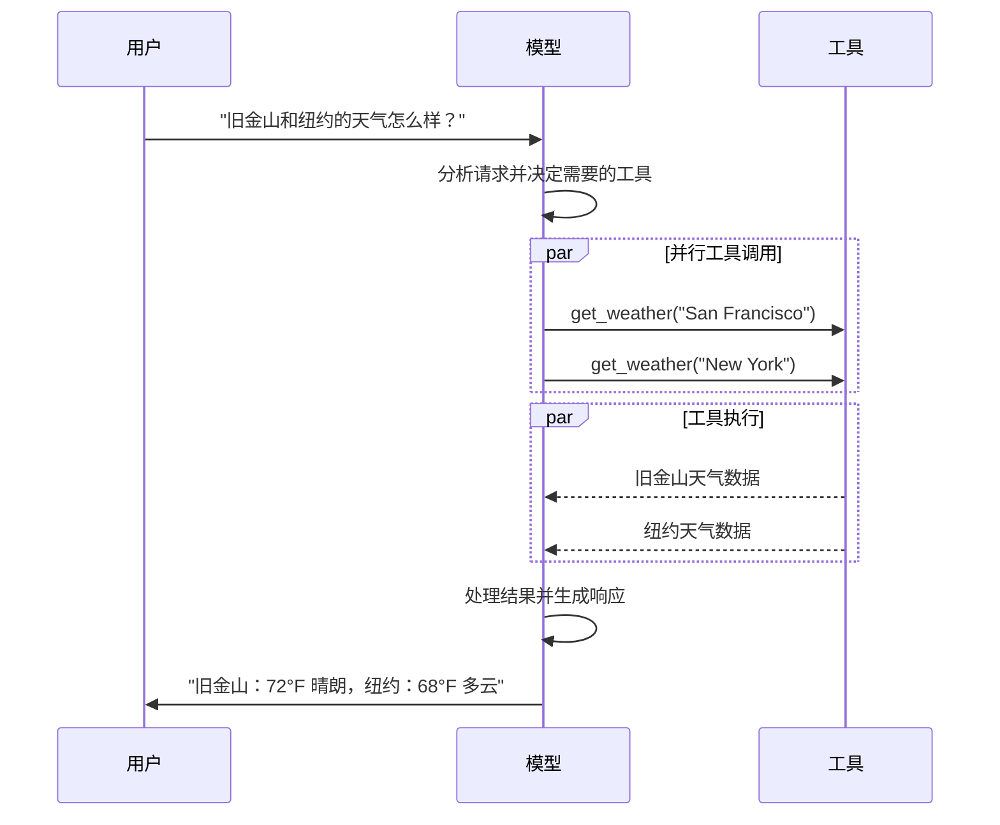

# 模型

[LLM](https://en.wikipedia.org/wiki/Large_language_model)（大语言模型）是强大的 AI 工具，能够像人类一样理解和生成文本。它们用途广泛，无需针对每个任务进行专门训练即可编写内容、翻译语言、摘要和回答问题。

除了文本生成之外，许多模型还支持：

*   [工具调用](#tool-calling) - 调用外部工具（如数据库查询或 API 调用）并在响应中使用结果。
*   [结构化输出](#structured-output) - 模型的响应被限制为遵循定义的格式。
*   [多模态](#multimodal) - 处理和返回文本以外的数据，如图像、音频和视频。
*   [推理](#reasoning) - 模型执行多步推理以得出结论。

模型是 [智能体](/oss/python/langchain/agents) 的推理引擎。它们驱动智能体的决策过程，确定调用哪些工具、如何解释结果以及何时提供最终答案。您选择的模型的质量和性能直接影响智能体的基线可靠性和性能。

不同的模型擅长不同的任务——有些更擅长遵循复杂指令，有些更擅长结构化推理，还有一些支持更大的上下文窗口以处理更多信息。LangChain 的标准模型接口让您可以访问许多不同的提供商集成，从而可以轻松地在不同模型之间进行实验和切换，以找到最适合您用例的模型。

有关提供商特定的集成信息和功能，请参阅提供商的 [聊天模型页面](/oss/python/integrations/chat)。

## 基本用法

模型有两种使用方式：

1.  **与智能体一起使用** - 在创建 [智能体](/oss/python/langchain/agents#model) 时可以动态指定模型。
2.  **独立使用** - 直接调用模型（在智能体循环之外），用于文本生成、分类或提取等任务，无需智能体框架。

相同的模型接口在这两种场景下都适用，让您能够灵活地从简单开始，并根据需要扩展到更复杂的基于智能体的工作流。

### 初始化模型

在 LangChain 中开始使用独立模型的最简单方法是使用 [`init_chat_model`](https://reference.langchain.com/python/langchain/chat_models/base/init_chat_model) 从您选择的聊天模型提供商初始化一个模型（如下示例）：

👉 阅读 [OpenAI 聊天模型集成文档](/oss/python/integrations/chat/openai/)

```shell
pip install -U "langchain[openai]"
```

```python
import os
from langchain.chat_models import init_chat_model

os.environ["OPENAI_API_KEY"] = "sk-..."
model = init_chat_model("gpt-5.2")
```

```python
import os
from langchain_openai import ChatOpenAI

os.environ["OPENAI_API_KEY"] = "sk-..."
model = ChatOpenAI(model="gpt-5.2")
```

👉 阅读 [Anthropic 聊天模型集成文档](/oss/python/integrations/chat/anthropic/)

```shell
pip install -U "langchain[anthropic]"
```

```python
import os
from langchain.chat_models import init_chat_model

os.environ["ANTHROPIC_API_KEY"] = "sk-..."
model = init_chat_model("claude-sonnet-4-6")
```

```python
import os
from langchain_anthropic import ChatAnthropic

os.environ["ANTHROPIC_API_KEY"] = "sk-..."
model = ChatAnthropic(model="claude-sonnet-4-6")
```

👉 阅读 [Azure 聊天模型集成文档](/oss/python/integrations/chat/azure_chat_openai/)

```shell
pip install -U "langchain[openai]"
```

```python
import os
from langchain.chat_models import init_chat_model

os.environ["AZURE_OPENAI_API_KEY"] = "..."
os.environ["AZURE_OPENAI_ENDPOINT"] = "..."
os.environ["OPENAI_API_VERSION"] = "2025-03-01-preview"
model = init_chat_model(
    "azure_openai:gpt-5.2",
    azure_deployment=os.environ["AZURE_OPENAI_DEPLOYMENT_NAME"],
)
```

```python
import os
from langchain_openai import AzureChatOpenAI

os.environ["AZURE_OPENAI_API_KEY"] = "..."
os.environ["AZURE_OPENAI_ENDPOINT"] = "..."
os.environ["OPENAI_API_VERSION"] = "2025-03-01-preview"
model = AzureChatOpenAI(
    model="gpt-5.2",
    azure_deployment=os.environ["AZURE_OPENAI_DEPLOYMENT_NAME"]
)
```

👉 阅读 [Google GenAI 聊天模型集成文档](/oss/python/integrations/chat/google_generative_ai/)

```shell
pip install -U "langchain[google-genai]"
```

```python
import os
from langchain.chat_models import init_chat_model

os.environ["GOOGLE_API_KEY"] = "..."
model = init_chat_model("google_genai:gemini-2.5-flash-lite")
```

```python
import os
from langchain_google_genai import ChatGoogleGenerativeAI

os.environ["GOOGLE_API_KEY"] = "..."
model = ChatGoogleGenerativeAI(model="gemini-2.5-flash-lite")
```

👉 阅读 [AWS Bedrock 聊天模型集成文档](/oss/python/integrations/chat/bedrock/)

```shell
pip install -U "langchain[aws]"
```

```python
from langchain.chat_models import init_chat_model

# 按照以下步骤配置您的凭证：
# https://docs.aws.amazon.com/bedrock/latest/userguide/getting-started.html
model = init_chat_model(
    "anthropic.claude-3-5-sonnet-20240620-v1:0",
    model_provider="bedrock_converse",
)
```

```python
from langchain_aws import ChatBedrock

model = ChatBedrock(model="anthropic.claude-3-5-sonnet-20240620-v1:0")
```

👉 阅读 [HuggingFace 聊天模型集成文档](/oss/python/integrations/chat/huggingface/)

```shell
pip install -U "langchain[huggingface]"
```

```python
import os
from langchain.chat_models import init_chat_model

os.environ["HUGGINGFACEHUB_API_TOKEN"] = "hf_..."
model = init_chat_model(
    "microsoft/Phi-3-mini-4k-instruct",
    model_provider="huggingface",
    temperature=0.7,
    max_tokens=1024,
)
```

```python
import os
from langchain_huggingface import ChatHuggingFace, HuggingFaceEndpoint

os.environ["HUGGINGFACEHUB_API_TOKEN"] = "hf_..."
llm = HuggingFaceEndpoint(
    repo_id="microsoft/Phi-3-mini-4k-instruct",
    temperature=0.7,
    max_length=1024,
)
model = ChatHuggingFace(llm=llm)
```

```python
response = model.invoke("为什么鹦鹉会说话？")
```

有关更多详细信息，包括如何传递模型 [参数](#parameters) 的信息，请参阅 [`init_chat_model`](https://reference.langchain.com/python/langchain/chat_models/base/init_chat_model)。

### 支持的模型

LangChain 支持所有主要的模型提供商，包括 OpenAI、Anthropic、Google、Azure、AWS Bedrock 等。每个提供商都提供多种具有不同功能的模型。

有关 LangChain 中支持模型的完整列表，请参阅 [集成页面](/oss/python/integrations/providers/overview)。

### 主要方法

*   **invoke** - 模型接收消息作为输入，并在生成完整响应后输出消息。
*   **stream** - 调用模型，但在生成时实时流式输出。
*   **batch** - 将多个请求批量发送到模型以更高效地处理。

除了聊天模型，LangChain 还支持其他相关技术，如嵌入模型和向量存储。有关详细信息，请参阅 [集成页面](/oss/python/integrations/providers/overview)。

## 参数

聊天模型接受的参数可用于配置其行为。支持的完整参数集因模型和提供商而异，但标准参数包括：

*   **model** - 要与提供商一起使用的特定模型的名称或标识符。您还可以使用 '{model_provider}:{model}' 格式在单个参数中指定模型及其提供商，例如 'openai:o1'。
*   **api_key** - 与模型提供商进行身份验证所需的密钥。这通常在您注册访问模型时颁发。通常通过设置环境变量来访问。
*   **temperature** - 控制模型输出的随机性。较高的数字使响应更具创造性；较低的数字使响应更确定性。
*   **max_tokens** - 限制响应中的总 token 数，有效控制输出的长度。
*   **timeout** - 在取消请求之前等待模型响应的最长时间（以秒为单位）。
*   **max_retries** - 如果请求因网络超时或速率限制等问题失败，系统将尝试重新发送请求的最大次数。重试使用指数退避和抖动。网络错误、速率限制 (429) 和服务器错误 (5xx) 会自动重试。客户端错误（如 401（未授权）或 404）不会重试。对于在不可靠网络上运行的长时间 [智能体](/oss/python/deepagents/overview) 任务，请考虑将此值增加到 10-15。

使用 [`init_chat_model`](https://reference.langchain.com/python/langchain/chat_models/base/init_chat_model)，将这些参数作为内联 `**kwargs` 传递：

```python
model = init_chat_model(
    "claude-sonnet-4-6",
    # 传递给模型的参数：
    temperature=0.7,
    timeout=30,
    max_tokens=1000,
    max_retries=6,  # 默认值；对于不可靠的网络可增加
)
```

每个聊天模型集成可能有额外的参数用于控制提供商特定的功能。例如，[`ChatOpenAI`](https://reference.langchain.com/python/langchain-openai/chat_models/base/ChatOpenAI) 有 `use_responses_api` 用于指示是使用 OpenAI Responses 还是 Completions API。

要查找给定聊天模型支持的所有参数，请前往 [聊天模型集成](/oss/python/integrations/chat) 页面。

---

## 调用

必须调用聊天模型才能生成输出。有三种主要的调用方法，每种适用于不同的用例。

### Invoke

调用模型最直接的方法是使用 [`invoke()`](https://reference.langchain.com/python/langchain-core/language_models/chat_models/BaseChatModel/invoke) 传递单条消息或消息列表。

```python
response = model.invoke("为什么鹦鹉有彩色的羽毛？")
print(response)
```

可以向聊天模型提供消息列表来表示对话历史。每条消息都有一个角色，模型使用该角色指示对话中谁发送了消息。有关角色、类型和内容的更多详细信息，请参阅 [消息](/oss/python/langchain/messages) 指南。

```python
conversation = [
    {"role": "system", "content": "你是一个将英语翻译成法语的有用助手。"},
    {"role": "user", "content": "翻译：I love programming."},
    {"role": "assistant", "content": "J'adore la programmation."},
    {"role": "user", "content": "翻译：I love building applications."}
]
response = model.invoke(conversation)
print(response)
# AIMessage("J'adore créer des applications.")
```

```python
from langchain.messages import HumanMessage, AIMessage, SystemMessage

conversation = [
    SystemMessage("你是一个将英语翻译成法语的有用助手。"),
    HumanMessage("翻译：I love programming."),
    AIMessage("J'adore la programmation."),
    HumanMessage("翻译：I love building applications.")
]
response = model.invoke(conversation)
print(response)
# AIMessage("J'adore créer des applications.")
```

如果您的调用返回类型是字符串，请确保您使用的是聊天模型而不是 LLM。传统的文本补全 LLM 直接返回字符串。LangChain 聊天模型以 "Chat" 为前缀，例如 [`ChatOpenAI`](https://reference.langchain.com/python/langchain-openai/chat_models/base/ChatOpenAI)(/oss/integrations/chat/openai)。

### Stream

大多数模型可以在生成输出时流式传输其内容。通过渐进式显示输出，流式传输显著改善用户体验，特别是对于较长的响应。

调用 [`stream()`](https://reference.langchain.com/python/langchain-core/language_models/chat_models/BaseChatModel/stream) 返回一个迭代器，在生成输出块时产生。您可以使用循环实时处理每个块：

```python
for chunk in model.stream("为什么鹦鹉有彩色的羽毛？"):
    print(chunk.text, end="|", flush=True)
```

```python
for chunk in model.stream("天空是什么颜色的？"):
    for block in chunk.content_blocks:
        if block["type"] == "reasoning" and (reasoning := block.get("reasoning")):
            print(f"推理：{reasoning}")
        elif block["type"] == "tool_call_chunk":
            print(f"工具调用块：{block}")
        elif block["type"] == "text":
            print(block["text"])
        else:
            ...
```

与 [`invoke()`](#invoke)（在模型完成生成完整响应后返回单个 [`AIMessage`](https://reference.langchain.com/python/langchain-core/messages/ai/AIMessage)）不同，`stream()` 返回多个 [`AIMessageChunk`](https://reference.langchain.com/python/langchain-core/messages/ai/AIMessageChunk) 对象，每个对象包含一部分输出文本。

重要的是，流中的每个块都设计为可以通过求和聚合为完整消息：

```python
full = None  # None | AIMessageChunk
for chunk in model.stream("天空是什么颜色的？"):
    full = chunk if full is None else full + chunk

print(full.text)
# 天空
# 天空是
# 天空通常是
# 天空通常是蓝色的
# ...
print(full.content_blocks)
# [{"type": "text", "text": "天空通常是蓝色的..."}]
```

生成的消息可以像使用 [`invoke()`](#invoke) 生成的消息一样处理——例如，它可以聚合到消息历史中并作为对话上下文传递回模型。

仅当程序中的所有步骤都知道如何处理块流时，流式传输才有效。例如，一个不支持流式传输的应用程序可能需要在处理之前将整个输出存储在内存中。

LangChain 聊天模型也可以使用 `astream_events()` 流式传输语义事件。这简化了基于事件类型和其他元数据的过滤，并将在后台聚合完整消息。请参阅下面的示例。

```python
async for event in model.astream_events("你好"):
    if event["event"] == "on_chat_model_start":
        print(f"输入：{event['data']['input']}")
    elif event["event"] == "on_chat_model_stream":
        print(f"Token: {event['data']['chunk'].text}")
    elif event["event"] == "on_chat_model_end":
        print(f"完整消息：{event['data']['output'].text}")
    else:
        pass
```

```txt
输入：你好
Token: 你
Token: 好
Token: ！
Token: 有
Token: 什
Token: 么
Token: 可
Token: 以
Token: 帮
Token: 你
Token: 的
Token: 吗
Token: ？
完整消息：你好！有什么我可以帮助你的吗？
```

有关事件类型和其他详细信息，请参阅 [`astream_events()`](https://reference.langchain.com/python/langchain_core/language_models/#langchain_core.language_models.chat_models.BaseChatModel.astream_events) 参考。

LangChain 通过在某些情况下自动启用流式模式来简化聊天模型的流式传输，即使您没有显式调用流式方法。当您使用非流式调用方法但仍希望流式传输整个应用程序（包括聊天模型的中间结果）时，这特别有用。

例如，在 [LangGraph 智能体](/oss/python/langchain/agents) 中，您可以在节点内调用 `model.invoke()`，但如果在流式模式下运行，LangChain 将自动委托给流式传输。

#### 工作原理

当您 `invoke()` 聊天模型时，如果检测到您正在尝试流式传输整个应用程序，LangChain 将自动切换到内部流式模式。就使用 invoke 的代码而言，调用的结果将是相同的；但是，当聊天模型被流式传输时，LangChain 将负责在 LangChain 的回调系统中调用 [`on_llm_new_token`](https://reference.langchain.com/python/langchain-core/callbacks/base/AsyncCallbackHandler/on_llm_new_token) 事件。

回调事件允许 LangGraph `stream()` 和 `astream_events()` 实时显示聊天模型的输出。

### Batch

对模型的独立请求集合进行批处理可以显著提高性能并降低成本，因为处理可以并行完成：

```python
responses = model.batch([
    "为什么鹦鹉有彩色的羽毛？",
    "飞机是如何飞行的？",
    "什么是量子计算？"
])
for response in responses:
    print(response)
```

本节介绍聊天模型方法 [`batch()`](https://reference.langchain.com/python/langchain_core/language_models/#langchain_core.language_models.chat_models.BaseChatModel.batch)，它在客户端并行化模型调用。它与推理提供商支持的批处理 API（如 [OpenAI](https://platform.openai.com/docs/guides/batch) 或 [Anthropic](https://platform.claude.com/docs/en/build-with-claude/batch-processing#message-batches-api)）**不同**。

默认情况下，[`batch()`](https://reference.langchain.com/python/langchain_core/language_models/#langchain_core.language_models.chat_models.BaseChatModel.batch) 仅返回整个批次的最终输出。如果您想在每个输入完成生成时接收其输出，可以使用 [`batch_as_completed()`](https://reference.langchain.com/python/langchain_core/language_models/#langchain_core.language_models.chat_models.BaseChatModel.batch_as_completed) 流式传输结果：

```python
for response in model.batch_as_completed([
    "为什么鹦鹉有彩色的羽毛？",
    "飞机是如何飞行的？",
    "什么是量子计算？"
]):
    print(response)
```

使用 [`batch_as_completed()`](https://reference.langchain.com/python/langchain_core/language_models/#langchain_core.language_models.chat_models.BaseChatModel.batch_as_completed) 时，结果可能乱序到达。每个结果都包含输入索引，以便在需要时匹配以重建原始顺序。

当使用 [`batch()`](https://reference.langchain.com/python/langchain_core/language_models/#langchain_core.language_models.chat_models.BaseChatModel.batch) 或 [`batch_as_completed()`](https://reference.langchain.com/python/langchain_core/language_models/#langchain_core.language_models.chat_models.BaseChatModel.batch_as_completed) 处理大量输入时，您可能希望控制最大并行调用数。这可以通过在 [`RunnableConfig`](https://reference.langchain.com/python/langchain-core/runnables/config/RunnableConfig) 字典中设置 [`max_concurrency`](https://reference.langchain.com/python/langchain-core/runnables/config/RunnableConfig) 属性来完成。

```python
model.batch(
    list_of_inputs,
    config={
        'max_concurrency': 5,  # 限制为 5 个并行调用
    }
)
```

有关支持属性的完整列表，请参阅 [`RunnableConfig`](https://reference.langchain.com/python/langchain-core/runnables/config/RunnableConfig) 参考。

有关批处理的更多详细信息，请参阅 [参考](https://reference.langchain.com/python/langchain_core/language_models/#langchain_core.language_models.chat_models.BaseChatModel.batch)。

---

## 工具调用

模型可以请求调用执行任务的工具，例如从数据库获取数据、搜索网络或运行代码。工具是以下内容的配对：

1.  模式，包括工具名称、描述和/或参数定义（通常是 JSON schema）
2.  要执行的函数或协程。

您可能会听到"函数调用"这个术语。我们与"工具调用"互换使用。

以下是用户和模型之间的基本工具调用流程：



要使您定义的工具可供模型使用，您必须使用 [`bind_tools`](https://reference.langchain.com/python/langchain-core/language_models/chat_models/BaseChatModel/bind_tools) 绑定它们。在后续调用中，模型可以根据需要选择调用任何绑定的工具。

一些模型提供商提供可通过模型或调用参数启用的内置工具（例如 [`ChatOpenAI`](/oss/python/integrations/chat/openai)、[`ChatAnthropic`](/oss/python/integrations/chat/anthropic)）。有关详细信息，请查看相应的 [提供商参考](/oss/python/integrations/providers/overview)。

有关创建工具的详细信息和其他选项，请参阅 [工具指南](/oss/python/langchain/tools)。

```python
from langchain.tools import tool

@tool
def get_weather(location: str) -> str:
    """获取某个位置的天气。"""
    return f"{location} 天气晴朗。"

model_with_tools = model.bind_tools([get_weather])  # [!code highlight]
response = model_with_tools.invoke("波士顿的天气怎么样？")
for tool_call in response.tool_calls:  # 查看模型进行的工具调用
    print(f"工具：{tool_call['name']}")
    print(f"参数：{tool_call['args']}")
```

当绑定用户定义的工具时，模型的响应包括执行工具的**请求**。当 [智能体](/oss/python/langchain/agents) 分开使用模型时，由您执行请求的工具并将结果返回给模型以用于后续推理。当使用 [智能体](/oss/python/langchain/agents) 时，智能体循环将为您处理工具执行循环。

下面，我们展示了一些使用工具调用的常见方法。

当模型返回工具调用时，您需要执行工具并将结果传递回模型。这会创建一个对话循环，模型可以使用工具结果生成最终响应。LangChain 包括处理此编排的 [智能体](/oss/python/langchain/agents) 抽象。以下是如何执行此操作的简单示例：

```python
# 将（可能多个）工具绑定到模型
model_with_tools = model.bind_tools([get_weather])

# 步骤 1：模型生成工具调用
messages = [{"role": "user", "content": "波士顿的天气怎么样？"}]
ai_msg = model_with_tools.invoke(messages)
messages.append(ai_msg)

# 步骤 2：执行工具并收集结果
for tool_call in ai_msg.tool_calls:
    # 使用生成的参数执行工具
    tool_result = get_weather.invoke(tool_call)
    messages.append(tool_result)

# 步骤 3：将结果传递回模型以获取最终响应
final_response = model_with_tools.invoke(messages)
print(final_response.text)
# "波士顿当前的天气是 72°F，晴朗。"
```

工具返回的每个 [`ToolMessage`](https://reference.langchain.com/python/langchain-core/messages/tool/ToolMessage) 都包含一个 `tool_call_id`，与原始工具调用匹配，帮助模型将结果与请求关联起来。

默认情况下，模型可以自由地根据用户的输入选择使用哪个绑定工具。但是，您可能希望强制选择工具，确保模型使用特定工具或给定列表中的**任何**工具：

```python
model_with_tools = model.bind_tools([tool_1], tool_choice="any")
```

```python
model_with_tools = model.bind_tools([tool_1], tool_choice="tool_1")
```

许多模型支持在适当时并行调用多个工具。这允许模型同时从不同来源收集信息。

```python
model_with_tools = model.bind_tools([get_weather])
response = model_with_tools.invoke(
    "波士顿和东京的天气怎么样？"
)
# 模型可能会生成多个工具调用
print(response.tool_calls)
# [
#   {'name': 'get_weather', 'args': {'location': 'Boston'}, 'id': 'call_1'},
#   {'name': 'get_weather', 'args': {'location': 'Tokyo'}, 'id': 'call_2'},
# ]
# 执行所有工具（可以使用异步并行完成）
results = []
for tool_call in response.tool_calls:
    if tool_call['name'] == 'get_weather':
        result = get_weather.invoke(tool_call)
        ...
    results.append(result)
```

模型智能地确定何时适合并行执行，基于请求操作的独立性。大多数支持工具调用的模型默认启用并行工具调用。一些模型（包括 [OpenAI](/oss/python/integrations/chat/openai) 和 [Anthropic](/oss/python/integrations/chat/anthropic)）允许您禁用此功能。为此，设置 `parallel_tool_calls=False`：

```python
model.bind_tools([get_weather], parallel_tool_calls=False)
```

在流式传输响应时，工具调用通过 [`ToolCallChunk`](https://reference.langchain.com/python/langchain-core/messages/tool/ToolCallChunk) 渐进式构建。这允许您在生成工具调用时查看它们，而不是等待完整响应。

```python
for chunk in model_with_tools.stream(
    "波士顿和东京的天气怎么样？"
):
    # 工具调用块渐进式到达
    for tool_chunk in chunk.tool_call_chunks:
        if name := tool_chunk.get("name"):
            print(f"工具：{name}")
        if id_ := tool_chunk.get("id"):
            print(f"ID: {id_}")
        if args := tool_chunk.get("args"):
            print(f"参数：{args}")
# 输出：
# 工具：get_weather
# ID: call_SvMlU1TVIZugrFLckFE2ceRE
# 参数：{"lo
# 参数：catio
# 参数：n": "B
# 参数：osto
# 参数：n"}
# 工具：get_weather
# ID: call_QMZdy6qInx13oWKE7KhuhOLR
# 参数：{"lo
# 参数：catio
# 参数：n": "T
# 参数：okyo
# 参数："}
```

您可以累积块以构建完整的工具调用：

```python
gathered = None
for chunk in model_with_tools.stream("波士顿的天气怎么样？"):
    gathered = chunk if gathered is None else gathered + chunk
print(gathered.tool_calls)
```

---

## 结构化输出

可以请求模型以与给定模式匹配的格式提供响应。这对于确保输出可以轻松解析并用于后续处理非常有用。

LangChain 支持多种模式类型和用于强制执行结构化输出的方法。要了解结构化输出，请参阅 [结构化输出](/oss/python/langchain/structured-output)。

[Pydantic 模型](https://docs.pydantic.dev/latest/concepts/models/#basic-model-usage)提供最丰富的功能集，包括字段验证、描述和嵌套结构。

```python
from pydantic import BaseModel, Field

class Movie(BaseModel):
    """一部有详细信息的电影。"""
    title: str = Field(description="电影标题")
    year: int = Field(description="电影发行年份")
    director: str = Field(description="电影导演")
    rating: float = Field(description="电影评分（满分 10 分）")

model_with_structure = model.with_structured_output(Movie)
response = model_with_structure.invoke("提供电影《盗梦空间》的详细信息")
print(response)
# Movie(title="盗梦空间", year=2010, director="克里斯托弗·诺兰", rating=8.8)
```

Python 的 `TypedDict` 提供了比 Pydantic 模型更简单的替代方案，适用于不需要运行时验证的情况。

```python
from typing_extensions import TypedDict, Annotated

class MovieDict(TypedDict):
    """一部有详细信息的电影。"""
    title: Annotated[str, ..., "电影标题"]
    year: Annotated[int, ..., "电影发行年份"]
    director: Annotated[str, ..., "电影导演"]
    rating: Annotated[float, ..., "电影评分（满分 10 分）"]

model_with_structure = model.with_structured_output(MovieDict)
response = model_with_structure.invoke("提供电影《盗梦空间》的详细信息")
print(response)
# {'title': '盗梦空间', 'year': 2010, 'director': '克里斯托弗·诺兰', 'rating': 8.8}
```

提供 [JSON Schema](https://json-schema.org/understanding-json-schema/about) 以获得最大控制和互操作性。

```python
import json

json_schema = {
    "title": "Movie",
    "description": "一部有详细信息的电影",
    "type": "object",
    "properties": {
        "title": {
            "type": "string",
            "description": "电影标题"
        },
        "year": {
            "type": "integer",
            "description": "电影发行年份"
        },
        "director": {
            "type": "string",
            "description": "电影导演"
        },
        "rating": {
            "type": "number",
            "description": "电影评分（满分 10 分）"
        }
    },
    "required": ["title", "year", "director", "rating"]
}

model_with_structure = model.with_structured_output(
    json_schema,
    method="json_schema",
)
response = model_with_structure.invoke("提供电影《盗梦空间》的详细信息")
print(response)
# {'title': '盗梦空间', 'year': 2010, ...}
```

**结构化输出的关键考虑因素**

*   **method 参数**：一些提供商支持不同的结构化输出方法：
    *   `'json_schema'`：使用提供商提供的专用结构化输出功能。
    *   `'function_calling'`：通过强制遵循给定模式的 [工具调用](#tool-calling) 派生结构化输出。
    *   `'json_mode'`：一些提供商提供的 `'json_schema'` 的前身。生成有效的 JSON，但必须在提示中描述模式。
*   **include raw**：设置 `include_raw=True` 以同时获取解析的输出和原始 AI 消息。
*   **验证**：Pydantic 模型提供自动验证。`TypedDict` 和 JSON Schema 需要手动验证。

有关支持的方法和配置选项，请参阅您的 [提供商集成页面](/oss/python/integrations/providers/overview)。

返回原始 [`AIMessage`](https://reference.langchain.com/python/langchain-core/messages/ai/AIMessage) 对象以及解析的表示形式可能很有用，以便访问响应元数据，如 [token 使用量](#token-usage)。为此，在调用 [`with_structured_output`](https://reference.langchain.com/python/langchain-core/language_models/chat_models/BaseChatModel/with_structured_output) 时设置 [`include_raw=True`](https://reference.langchain.com/python/langchain-core/language_models/chat_models/BaseChatModel/with_structured_output)：

```python
from pydantic import BaseModel, Field

class Movie(BaseModel):
    """一部有详细信息的电影。"""
    title: str = Field(description="电影标题")
    year: int = Field(description="电影发行年份")
    director: str = Field(description="电影导演")
    rating: float = Field(description="电影评分（满分 10 分）")

model_with_structure = model.with_structured_output(Movie, include_raw=True)  # [!code highlight]
response = model_with_structure.invoke("提供电影《盗梦空间》的详细信息")
response
# {
#   "raw": AIMessage(...),
#   "parsed": Movie(title=..., year=..., ...),
#   "parsing_error": None,
# }
```

模式可以嵌套：

```python
from pydantic import BaseModel, Field

class Actor(BaseModel):
    name: str
    role: str

class MovieDetails(BaseModel):
    title: str
    year: int
    cast: list[Actor]
    genres: list[str]
    budget: float | None = Field(None, description="预算（百万美元）")

model_with_structure = model.with_structured_output(MovieDetails)
```

```python
from typing_extensions import Annotated, TypedDict

class Actor(TypedDict):
    name: str
    role: str

class MovieDetails(TypedDict):
    title: str
    year: int
    cast: list[Actor]
    genres: list[str]
    budget: Annotated[float | None, ..., "预算（百万美元）"]

model_with_structure = model.with_structured_output(MovieDetails)
```

---

## 高级主题

### 模型配置文件

模型配置文件需要 `langchain>=1.1`。

LangChain 聊天模型可以通过 `profile` 属性公开支持的功能和 capabilities 字典：

```python
model.profile
# {
#   "max_input_tokens": 400000,
#   "image_inputs": True,
#   "reasoning_output": True,
#   "tool_calling": True,
#   ...
# }
```

有关完整字段集，请参阅 [API 参考](https://reference.langchain.com/python/langchain-core/language_models/model_profile/ModelProfile)。

大部分模型配置文件数据由 [models.dev](https://github.com/sst/models.dev) 项目提供支持，这是一个提供模型能力数据的开源项目。这些数据使用 LangChain 的其他字段进行了增强，以便与 LangChain 一起使用。这些增强数据在上游项目发展时保持同步。

模型配置文件数据允许应用程序动态地处理模型能力。例如：

1.  [摘要中间件](/oss/python/langchain/middleware/built-in#summarization) 可以根据模型的上下文窗口大小触发摘要。
2.  `create_agent` 中的 [结构化输出](/oss/python/langchain/structured-output) 策略可以自动推断（例如，通过检查对原生结构化输出功能的支持）。
3.  模型输入可以根据支持的 [模态](#multimodal) 和最大输入 token 数进行门控。
4.  [Deep Agents CLI](/oss/python/deepagents/cli) 过滤 [交互式模型切换器](/oss/python/deepagents/cli/providers#which-models-appear-in-the-switcher) 到配置文件报告 `tool_calling` 支持和文本 I/O 的模型，并在选择器详细视图中显示上下文窗口大小和功能标志。

如果模型配置文件数据缺失、过时或不正确，可以更改它们。

**选项 1（快速修复）**

您可以使用任何有效的配置文件实例化聊天模型：

```python
custom_profile = {
    "max_input_tokens": 100_000,
    "tool_calling": True,
    "structured_output": True,
    # ...
}
model = init_chat_model("...", profile=custom_profile)
```

`profile` 也是一个普通的 `dict`，可以就地更新。如果模型实例是共享的，请考虑使用 `model_copy` 以避免改变共享状态。

```python
new_profile = model.profile | {"key": "value"}
model.model_copy(update={"profile": new_profile})
```

**选项 2（在上游修复数据）**

数据的主要来源是 [models.dev](https://models.dev/) 项目。这些数据与 LangChain [集成包](/oss/python/integrations/providers/overview) 中的其他字段和覆盖合并，并与这些包一起发布。

可以通过以下过程更新模型配置文件数据：

1.  （如果需要）通过向其 [GitHub 仓库](https://github.com/sst/models.dev) 提交 pull request 来更新 [models.dev](https://models.dev/) 的源数据。
2.  （如果需要）通过向 LangChain [集成包](/oss/python/integrations/providers/overview) 提交 pull request 来更新 `langchain_/data/profile_augmentations.toml` 中的其他字段和覆盖。
3.  使用 [`langchain-model-profiles`](https://pypi.org/project/langchain-model-profiles/) CLI 工具从 [models.dev](https://models.dev/) 提取最新数据，合并增强并更新配置文件数据：

```bash
pip install langchain-model-profiles
```

```bash
langchain-profiles refresh --provider <provider> --data-dir <data_dir>
```

此命令：

*   从 models.dev 下载 `<provider>` 的最新数据
*   合并 `<data_dir>` 中 `profile_augmentations.toml` 的增强
*   将合并的配置文件写入 `<data_dir>` 中的 `profiles.py`

例如：来自 LangChain 单体仓库中的 [`libs/partners/anthropic`](https://github.com/langchain-ai/langchain/tree/master/libs/partners/anthropic)：

```bash
uv run --with langchain-model-profiles --provider anthropic --data-dir langchain_anthropic/data
```

模型配置文件是测试版功能。配置文件的格式可能会更改。

### 多模态

某些模型可以处理和返回非文本数据，如图像、音频和视频。您可以通过提供 [内容块](/oss/python/langchain/messages#message-content) 将非文本数据传递给模型。

所有具有底层多模态功能的 LangChain 聊天模型都支持：

1.  跨提供商标准格式的数据（请参阅 [我们的消息指南](/oss/python/langchain/messages)）
2.  OpenAI [聊天补全](https://platform.openai.com/docs/api-reference/chat) 格式
3.  特定提供商的任何原生格式（例如，Anthropic 模型接受 Anthropic 原生格式）

有关详细信息，请参阅消息指南的 [多模态部分](/oss/python/langchain/messages#multimodal)。

一些模型可以在其响应中返回多模态数据。如果被调用这样做，生成的 [`AIMessage`](https://reference.langchain.com/python/langchain-core/messages/ai/AIMessage) 将具有多模态类型的内容块。

```python
response = model.invoke("创建一张猫的图片")
print(response.content_blocks)
# [
#   {"type": "text", "text": "这是一张猫的图片"},
#   {"type": "image", "base64": "...", "mime_type": "image/jpeg"},
# ]
```

有关特定提供商的详细信息，请参阅 [集成页面](/oss/python/integrations/providers/overview)。

### 推理

许多模型能够执行多步推理以得出结论。这涉及将复杂问题分解为更小、更易管理的步骤。

**如果底层模型支持，** 您可以展示此推理过程，以更好地了解模型如何得出最终答案。

```python
for chunk in model.stream("为什么鹦鹉有彩色的羽毛？"):
    reasoning_steps = [r for r in chunk.content_blocks if r["type"] == "reasoning"]
    print(reasoning_steps if reasoning_steps else chunk.text)
```

```python
response = model.invoke("为什么鹦鹉有彩色的羽毛？")
reasoning_steps = [b for b in response.content_blocks if b["type"] == "reasoning"]
print(" ".join(step["reasoning"] for step in reasoning_steps))
```

根据模型的不同，您有时可以指定模型在推理中应投入的努力程度。同样，您可以请求模型完全关闭推理。这可能采用分类推理"层级"（例如 `'low'` 或 `'high'`）或整数 token 预算的形式。

有关详细信息，请参阅您的聊天模型的 [集成页面](/oss/python/integrations/providers/overview) 或 [参考](https://reference.langchain.com/python/integrations/)。

### 本地模型

LangChain 支持在您自己的硬件上本地运行模型。这对于数据隐私至关重要、您想调用自定义模型或您想避免使用基于云的模型所产生的成本的场景非常有用。

[Ollama](/oss/python/integrations/chat/ollama) 是在本地运行聊天和嵌入模型的最简单方法之一。

### 提示缓存

许多提供商提供提示缓存功能，以减少重复处理相同 token 的延迟和成本。这些功能可以是**隐式**或**显式**的：

*   **隐式提示缓存：** 如果请求命中缓存，提供商将自动传递成本节省。示例：[OpenAI](/oss/python/integrations/chat/openai) 和 [Gemini](/oss/python/integrations/chat/google_generative_ai)。
*   **显式缓存：** 提供商允许您手动指示缓存点以获得更大的控制权或保证成本节省。示例：
    *   [`ChatOpenAI`](https://reference.langchain.com/python/langchain-openai/chat_models/base/ChatOpenAI)（通过 `prompt_cache_key`）
    *   Anthropic 的 [`AnthropicPromptCachingMiddleware`](/oss/python/integrations/chat/anthropic#prompt-caching)
    *   [Gemini](https://reference.langchain.com/python/integrations/langchain_google_genai)。
    *   [AWS Bedrock](/oss/python/integrations/chat/bedrock#prompt-caching)

提示缓存通常仅在最小输入 token 阈值以上时启用。有关详细信息，请参阅 [提供商页面](/oss/python/integrations/chat)。

缓存使用将反映在模型响应的 [使用元数据](/oss/python/langchain/messages#token-usage) 中。

### 服务器端工具使用

一些提供商支持服务器端 [工具调用](#tool-calling) 循环：模型可以与网络搜索、代码解释器和其他工具交互，并在一次对话中分析结果。

如果模型在服务器端调用工具，响应消息的内容将包括表示工具调用和结果的内容。访问响应消息的 [内容块](/oss/python/langchain/messages#standard-content-blocks) 将以提供商无关的格式返回服务器端工具调用和结果：

```python
from langchain.chat_models import init_chat_model

model = init_chat_model("gpt-4.1-mini")
tool = {"type": "web_search"}
model_with_tools = model.bind_tools([tool])
response = model_with_tools.invoke("今天有什么积极的新闻故事吗？")
print(response.content_blocks)
```

```python
[
  {
    "type": "server_tool_call",
    "name": "web_search",
    "args": {
      "query": "今天的积极新闻故事",
      "type": "search"
    },
    "id": "ws_abc123"
  },
  {
    "type": "server_tool_result",
    "tool_call_id": "ws_abc123",
    "status": "success"
  },
  {
    "type": "text",
    "text": "这是今天的一些积极新闻故事...",
    "annotations": [
      {
        "end_index": 410,
        "start_index": 337,
        "title": "文章标题",
        "type": "citation",
        "url": "..."
      }
    ]
  }
]
```

这表示一次对话；没有像客户端 [工具调用](#tool-calling) 那样需要传递的关联 [ToolMessage](/oss/python/langchain/messages#tool-message) 对象。

有关可用工具和使用详细信息，请参阅您给定提供商的 [集成页面](/oss/python/integrations/chat)。

### 速率限制

许多聊天模型提供商对在给定时间段内可以进行的调用次数施加限制。如果您达到速率限制，您通常会收到来自提供商的速率限制错误响应，并且需要等待才能发出更多请求。

为了帮助管理速率限制，聊天模型集成接受在初始化期间提供的 `rate_limiter` 参数来控制发出请求的速率。

LangChain 附带（可选）内置的 [`InMemoryRateLimiter`](https://reference.langchain.com/python/langchain-core/rate_limiters/InMemoryRateLimiter)。此限制器是线程安全的，可以由同一进程中的多个线程共享。

```python
from langchain_core.rate_limiters import InMemoryRateLimiter

rate_limiter = InMemoryRateLimiter(
    requests_per_second=0.1,  # 每 10 秒 1 个请求
    check_every_n_seconds=0.1,  # 每 100 毫秒检查是否允许发出请求
    max_bucket_size=10,  # 控制最大突发大小。
)
model = init_chat_model(
    model="gpt-5",
    model_provider="openai",
    rate_limiter=rate_limiter  # [!code highlight]
)
```

提供的速率限制器只能限制单位时间内的请求数。如果您还需要根据请求大小进行限制，它将无法帮助。

### 基础 URL 和代理设置

您可以为实施 OpenAI Chat Completions API 的提供商配置自定义基础 URL。`model_provider="openai"`（或直接使用 `ChatOpenAI`）针对官方 OpenAI API 规范。路由器和代理的提供商特定字段可能不会被提取或保留。

对于 OpenRouter 和 LiteLLM，建议使用专用集成：

*   [通过 `ChatOpenRouter` 的 OpenRouter](/oss/python/integrations/chat/openrouter) (`langchain-openrouter`)
*   [通过 `ChatLiteLLM` / `ChatLiteLLMRouter` 的 LiteLLM](/oss/python/integrations/chat) (`langchain-litellm`)

许多模型提供商提供与 OpenAI 兼容的 API（例如 [Together AI](https://www.together.ai/)、[vLLM](https://github.com/vllm-project/vllm)）。您可以通过指定适当的 `base_url` 参数将这些提供商与 [`init_chat_model`](https://reference.langchain.com/python/langchain/chat_models/base/init_chat_model) 一起使用：

```python
model = init_chat_model(
    model="MODEL_NAME",
    model_provider="openai",
    base_url="BASE_URL",
    api_key="YOUR_API_KEY",
)
```

使用直接聊天模型类实例化时，参数名称可能因提供商而异。有关详细信息，请查看相应的 [参考](/oss/python/integrations/providers/overview)。

对于需要 HTTP 代理的部署，一些模型集成支持代理配置：

```python
from langchain_openai import ChatOpenAI

model = ChatOpenAI(
    model="gpt-4.1",
    openai_proxy="http://proxy.example.com:8080"
)
```

代理支持因集成而异。有关代理配置选项，请查看特定模型提供商的 [参考](/oss/python/integrations/providers/overview)。

### 对数概率

某些模型可以配置为返回 token 级对数概率，表示给定 token 的可能性，方法是在初始化模型时设置 `logprobs` 参数：

```python
model = init_chat_model(
    model="gpt-4.1",
    model_provider="openai"
).bind(logprobs=True)
response = model.invoke("为什么鹦鹉会说话？")
print(response.response_metadata["logprobs"])
```

### Token 使用量

许多模型提供商在调用响应中返回 token 使用量信息。可用时，此信息将包含在相应模型生成的 [`AIMessage`](https://reference.langchain.com/python/langchain-core/messages/ai/AIMessage) 对象上。

有关更多详细信息，请参阅 [消息](/oss/python/langchain/messages) 指南。

一些提供商 API（特别是 OpenAI 和 Azure OpenAI 聊天补全）要求用户在流式上下文中选择接收 token 使用量数据。有关详细信息，请参阅集成指南的 [流式使用量元数据](/oss/python/integrations/chat/openai#streaming-usage-metadata) 部分。

您可以使用回调或上下文管理器来跟踪应用程序中模型的聚合 token 计数，如下所示：

```python
from langchain.chat_models import init_chat_model
from langchain_core.callbacks import UsageMetadataCallbackHandler

model_1 = init_chat_model(model="gpt-4.1-mini")
model_2 = init_chat_model(model="claude-haiku-4-5-20251001")
callback = UsageMetadataCallbackHandler()
result_1 = model_1.invoke("你好", config={"callbacks": [callback]})
result_2 = model_2.invoke("你好", config={"callbacks": [callback]})
print(callback.usage_metadata)
```

```python
{
  'gpt-4.1-mini-2025-04-14': {
    'input_tokens': 8,
    'output_tokens': 10,
    'total_tokens': 18,
    'input_token_details': {'audio': 0, 'cache_read': 0},
    'output_token_details': {'audio': 0, 'reasoning': 0}
  },
  'claude-haiku-4-5-20251001': {
    'input_tokens': 8,
    'output_tokens': 21,
    'total_tokens': 29,
    'input_token_details': {'cache_read': 0, 'cache_creation': 0}
  }
}
```

```python
from langchain.chat_models import init_chat_model
from langchain_core.callbacks import get_usage_metadata_callback

model_1 = init_chat_model(model="gpt-4.1-mini")
model_2 = init_chat_model(model="claude-haiku-4-5-20251001")
with get_usage_metadata_callback() as cb:
    model_1.invoke("你好")
    model_2.invoke("你好")
print(cb.usage_metadata)
```

```python
{
  'gpt-4.1-mini-2025-04-14': {
    'input_tokens': 8,
    'output_tokens': 10,
    'total_tokens': 18,
    'input_token_details': {'audio': 0, 'cache_read': 0},
    'output_token_details': {'audio': 0, 'reasoning': 0}
  },
  'claude-haiku-4-5-20251001': {
    'input_tokens': 8,
    'output_tokens': 21,
    'total_tokens': 29,
    'input_token_details': {'cache_read': 0, 'cache_creation': 0}
  }
}
```

### 调用配置

调用模型时，您可以使用 [`RunnableConfig`](https://reference.langchain.com/python/langchain-core/runnables/config/RunnableConfig) 字典通过 `config` 参数传递其他配置。这提供了对执行行为、回调和元数据跟踪的运行时控制。

常见配置选项包括：

```python
response = model.invoke(
    "给我讲个笑话",
    config={
        "run_name": "joke_generation",  # 此运行的自定义名称
        "tags": ["humor", "demo"],  # 用于分类的标签
        "metadata": {"user_id": "123"},  # 自定义元数据
        "callbacks": [my_callback_handler],  # 回调处理程序
    }
)
```

这些配置值在以下情况下特别有用：

*   使用 [LangSmith](/langsmith/home) 跟踪进行调试
*   实施自定义日志记录或监控
*   在生产环境中控制资源使用
*   在复杂管道中跟踪调用

| 配置选项 | 描述 |
| :--- | :--- |
| **run_name** | 在日志和跟踪中识别此特定调用。不传递给子调用。 |
| **tags** | 传递给所有子调用的标签，用于在调试工具中过滤和组织。 |
| **metadata** | 用于跟踪其他上下文的自定义键值对，传递给所有子调用。 |
| **max_concurrency** | 使用 [`batch()`](https://reference.langchain.com/python/langchain_core/language_models/#langchain_core.language_models.chat_models.BaseChatModel.batch) 或 [`batch_as_completed()`](https://reference.langchain.com/python/langchain_core/language_models/#langchain_core.language_models.chat_models.BaseChatModel.batch_as_completed) 时控制最大并行调用数。 |
| **callbacks** | 用于监控和响应执行期间事件的处理程序。 |
| **recursion_limit** | 链的最大递归深度，以防止复杂管道中的无限循环。 |

有关所有支持属性的完整列表，请参阅 [`RunnableConfig`](https://reference.langchain.com/python/langchain-core/runnables/config/RunnableConfig) 参考。

### 可配置模型

您还可以通过指定 [`configurable_fields`](https://reference.langchain.com/python/langchain_core/language_models/#langchain_core.language_models.chat_models.BaseChatModel.configurable_fields) 创建运行时可配置的模型。如果您未指定模型值，则 `'model'` 和 `'model_provider'` 默认是可配置的。

```python
from langchain.chat_models import init_chat_model

configurable_model = init_chat_model(temperature=0)
configurable_model.invoke(
    "你叫什么名字",
    config={"configurable": {"model": "gpt-5-nano"}},  # 使用 GPT-5-Nano 运行
)
configurable_model.invoke(
    "你叫什么名字",
    config={"configurable": {"model": "claude-sonnet-4-6"}},  # 使用 Claude 运行
)
```

我们可以创建具有默认模型值的可配置模型，指定哪些参数是可配置的，并为可配置参数添加前缀：

```python
first_model = init_chat_model(
    model="gpt-4.1-mini",
    temperature=0,
    configurable_fields=("model", "model_provider", "temperature", "max_tokens"),
    config_prefix="first",  # 当您有多个模型的链时很有用
)
first_model.invoke("你叫什么名字")
```

```python
first_model.invoke(
    "你叫什么名字",
    config={
        "configurable": {
            "first_model": "claude-sonnet-4-6",
            "first_temperature": 0.5,
            "first_max_tokens": 100,
        }
    },
)
```

有关 `configurable_fields` 和 `config_prefix` 的更多详细信息，请参阅 [`init_chat_model`](https://reference.langchain.com/python/langchain/chat_models/base/init_chat_model) 参考。

我们可以在可配置模型上调用声明性操作，如 `bind_tools`、`with_structured_output`、`with_configurable` 等，并以与常规实例化的聊天模型对象相同的方式链接可配置模型。

```python
from pydantic import BaseModel, Field

class GetWeather(BaseModel):
    """获取给定位置的当前天气"""
    location: str = Field(description="城市和州，例如 San Francisco, CA")

class GetPopulation(BaseModel):
    """获取给定位置的当前人口"""
    location: str = Field(description="城市和州，例如 San Francisco, CA")

model = init_chat_model(temperature=0)
model_with_tools = model.bind_tools([GetWeather, GetPopulation])
model_with_tools.invoke(
    "2024 年洛杉矶和纽约哪个更大",
    config={"configurable": {"model": "gpt-4.1-mini"}}
).tool_calls
```

```python
[
  {
    'name': 'GetPopulation',
    'args': {'location': 'Los Angeles, CA'},
    'id': 'call_Ga9m8FAArIyEjItHmztPYA22',
    'type': 'tool_call'
  },
  {
    'name': 'GetPopulation',
    'args': {'location': 'New York, NY'},
    'id': 'call_jh2dEvBaAHRaw5JUDthOs7rt',
    'type': 'tool_call'
  }
]
```

```python
model_with_tools.invoke(
    "2024 年洛杉矶和纽约哪个更大",
    config={"configurable": {"model": "claude-sonnet-4-6"}},
).tool_calls
```

```python
[
  {
    'name': 'GetPopulation',
    'args': {'location': 'Los Angeles, CA'},
    'id': 'toolu_01JMufPf4F4t2zLj7miFeqXp',
    'type': 'tool_call'
  },
  {
    'name': 'GetPopulation',
    'args': {'location': 'New York City, NY'},
    'id': 'toolu_01RQBHcE8kEEbYTuuS8WqY1u',
    'type': 'tool_call'
  }
]
```

---

[在 GitHub 上编辑此页面](https://github.com/langchain-ai/docs/edit/main/src/oss/langchain/models.mdx) 或 [提交问题](https://github.com/langchain-ai/docs/issues/new/choose)。通过 MCP 将这些文档连接到 Claude、VSCode 等，以获得实时答案。
